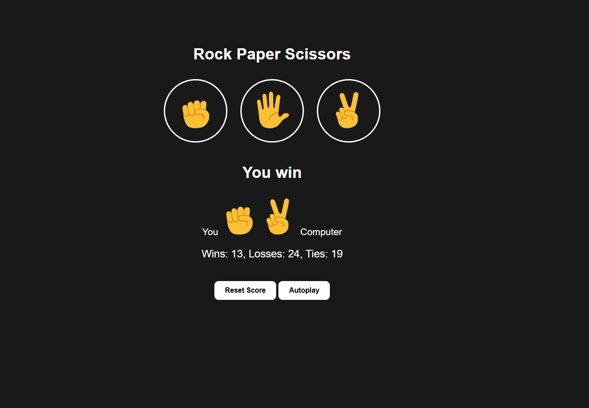

# Rock Paper Scissors Game 🎮

A simple Rock Paper Scissors game built using HTML, CSS, and JavaScript.

Features
- Interactive gameplay vs computer
- Autoplay mode with interval-based play
- Score tracking and result display

Tech Stack
- HTML
- CSS
- JavaScript (Vanilla)

How to Run
1. Clone this repo
2. Open `index.html` in your browser

Screenshots

Future Enhancements
- Add sound effects
- Improve UI/UX
- Save scores to local storage

📄 License
MIT
